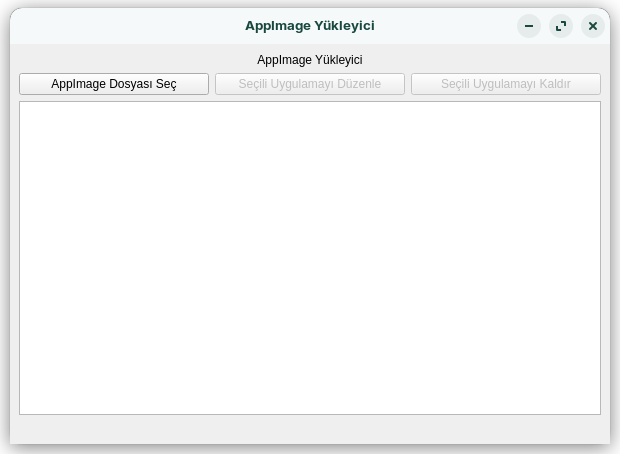
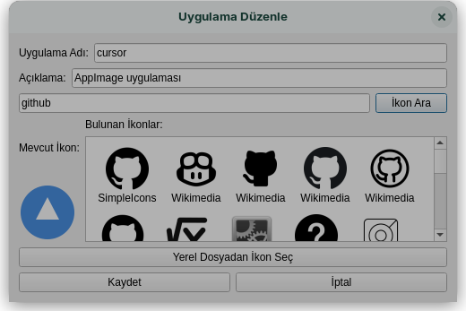

# AppImages to Desktop

Linux sistemlerde AppImage uygulamalarını kolayca yönetmenizi sağlayan bir araç.





## Özellikler

- AppImage dosyalarını kolayca yükleme
- Masaüstü kısayolu ve uygulama menüsüne otomatik ekleme
- İkon otomatik indirme ve ayarlama
- Yüklü uygulamaları düzenleme ve kaldırma
- Sandbox modu desteği
- İnternet üzerinden ikon arama ve seçme
- Çoklu API desteği ile gelişmiş ikon arama

## Gereksinimler

- Python 3.8+
- PyQt5
- python-magic
- requests
- cairosvg
- aiohttp
- aiofiles

## Kurulum

1. Repository'yi klonlayın:
```bash
git clone https://github.com/erkdgn/AppImages-to-Desktop.git
cd AppImages-to-Desktop
```

2. Gerekli paketleri yükleyin:
```bash
pip install -r requirements.txt
```

3. Uygulamayı çalıştırın:
```bash
python3 appimage_installer.py
```

## Kullanım

1. "AppImage Dosyası Seç" butonuna tıklayın
2. Yüklemek istediğiniz .AppImage dosyasını seçin
3. Sandbox modunu seçin (isteğe bağlı)
4. Uygulama otomatik olarak:
   - AppImage dosyası ~/.local/share/appimages dizinine kopyalanır
   - Masaüstünde kısayol oluşturulur
   - Uygulama menüsüne eklenir (Activities menüsünde görünür)

Yüklü uygulamaları düzenlemek için:
1. Listeden bir uygulama seçin
2. "Seçili Uygulamayı Düzenle" butonuna tıklayın
3. İsim, açıklama ve ikonu değiştirin

## Lisans

Bu proje MIT lisansı altında lisanslanmıştır. Detaylar için [LICENSE](LICENSE) dosyasına bakın. 